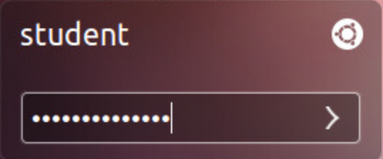
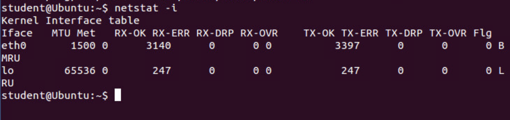
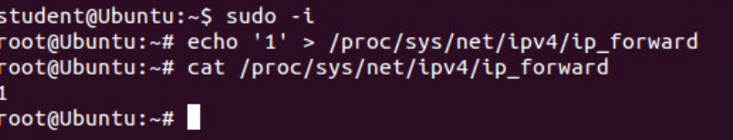
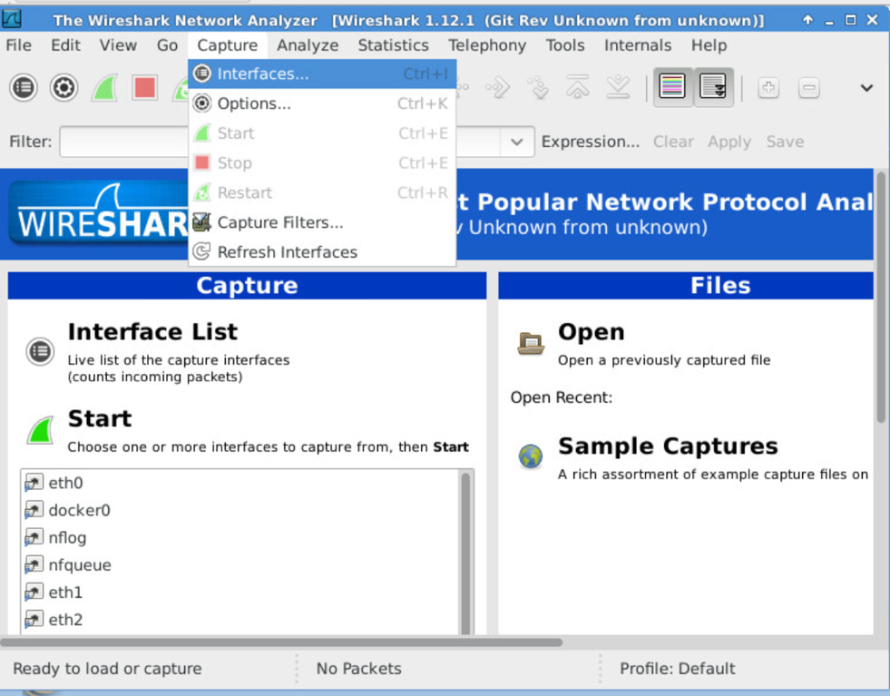

# Using tcpdump to Capture and Analyze Network Traffic

## 1.1. Using tcpdump to Capture ICMP Traffic

1\. Launch the SecOnion virtual machine.

2\. On the login screen, type soadmin as the username and mypassword as
the password. Click Log In.

>  alt="A screenshot of a computer login Description automatically generated" />

3\. Once logged in, click the start button followed by clicking on
> Terminal Emulator to launch a new terminal.

>  alt="A screenshot of a computer Description automatically generated" />

4\. Type the command below followed by pressing the Enter key. If
> prompted, enter mypassword for root privileges.
>
> soadmin@Security-Onion:~\$ sudo service nsm status
>
5\. Type the command below to view all available interfaces on the
> system.
>
>  alt="A computer screen shot of a computer program Description automatically generated" />

6\. Issue the command below to identify which flags are configured for
each interface:

soadmin@Security-Onion:~\$ netstat -i

 7\. To familiarize yourself with the tcpdump utility, type the
> following command to view several available options for tcpdump:
>
> soadmin@Security-Onion:~\$ tcpdump
>
>  alt="A screen shot of a computer screen Description automatically generated" />

8\. Launch the Kali virtual machine to access the graphical login
screen.

9\. Click on the terminal icon located in the top menu bar.

>  style="width:2.48611in;height:0.29167in" />
>
10\. Type the following command to initiate a continuous ping to the
> Ubuntu system. Leave the pings running in the background and proceed
> to the next step

>  alt="A screenshot of a computer Description automatically generated" />
>
11\. Switch back to the SecOnion system. In a terminal, run tcpdump on
> the internal network by entering the command below. If prompted with a
> password, enter mypassword.
>
> soadmin@Security-Onion:~\$ sudo tcpdump –i eth0 icmp
>
12\. Notice the output that tcpdump provides: HH:MM:SS.mmmmmm IP src
> \> dst: ptype, id, seq, len. Also, take note that for each echo
> request, there is a reply.
>
>  alt="A screen shot of a computer Description automatically generated" />
>
13\. After a minute, press CTRL+C to stop tcpdump from running and
> discontinue the network capture.
>
14\. From an administrator’s standpoint, we may want to save the
> output from a tcpdump capture and save it automatically into a
> compatible file to view later with a program such as Wireshark.
> Initiate the command below to capture traffic on the 192.168.1.0/24
> network and sending it to a file. If prompted with a password, enter
> mypassword.
>
>  style="width:10.95833in;height:0.72222in" />
>
15\. Wait for about 1-2 minutes until all 100 packets are captured.
>
>  alt="A black screen with white text Description automatically generated" />
>
16\. To view the captured file in a graphical user interface like
> Wireshark, enter the command below in the SecOnion terminal. If
> prompted with a password, enter mypassword.
>
> soadmin@Security-Onion:~\$ sudo wireshark netcapture1.pcap
>
17\. If prompted with a warning message, click OK to continue.
>
18\. If another warning message appears, click OK again.
>
19\. Notice the traffic listed that takes place on the 192.168.1.0/24
> network.
>
>  alt="A screenshot of a computer Description automatically generated" />
>
20\. Close Wireshark
>
21\. Switch to the Kali machine and press CTRL+C to stop the
> continuous pings

## 1.2. Using tcpdump to Capture ARP Traffic

1\. Change focus to the SecOnion system.

2\. In a terminal window, enter the ARP command below and take note of
    the results.

>soadmin@Security-Onion:~\$

>  style="width:8.72222in;height:0.80556in" />
>
3\. Enter the command below to capture ARP packets. If prompted with a
> password, enter mypassword.
>
>  alt="A screen shot of a computer Description automatically generated" />

4\. Launch the Ubuntu virtual machine to access the graphical login
screen.

5\. Log in as student with securepassword as the password.

>  alt="A screen shot of a computer Description automatically generated" />

6\. Open a terminal window by clicking on the terminal icon located in
the left menu pane.

>  alt="A black square with white text Description automatically generated" />

7\. Type the ping command below:

student@Ubuntu:~\$ ping –c4 192.168.1.6

8\. Switch back to SecOnion and press CTRL+C to stop the tcpdump
> capture. Notice the ARP output: HH:MM:SS:mmmmmm srcMAC \> dstMAC:
> ptype, len, request/response, length.

9\. Type the command shown below to display the ARP table. Notice the
> ARP entry for the IP address 192.168.1.50.
>
> soadmin@Security-Onion:~\$ arp -n
>
>  style="width:8.54167in;height:1.05556in" />

## 1.3. Using arpspoof to Spoof Network Traffic

1\. Change focus to the **Ubuntu** system
>
2\. In the terminal window, enter the command below to see whether
> eth0 is in promiscuous mode.
>
> student@Ubuntu:~\$ netstat -i
>
>  alt="A screenshot of a computer Description automatically generated" />
>
3\. Notice that eth0 is not in promiscuous mode. To change this, enter
> the command below. If prompted with a password, enter securepassword.
>
> student@Ubuntu:~\$ sudo ip link set eth0 promisc on
>
4\. Enter the netstat command once more to confirm the changes took
> effect.
>
> student@Ubuntu:~\$ netstat -i
>
>  alt="A black background with white text Description automatically generated" />
>
5\. Once confirmed, configure the Ubuntu system to act as a router
> between the pfSense router and the victim (in this case the SecOnion
> system). Type the commands below to change the value from ‘0’ to ‘1’.
> This will help by not modifying the source address of packets going
> through. If prompted with a password, enter securepassword
>
>  alt="A screen shot of a computer code Description automatically generated" />
>
6\. Flush out the entire ARP table by entering the command below. If
> prompted with a password, enter securepassword.
>
> root@Ubuntu:!# sudo ip –s –s neigh flush all
>
>  alt="A screenshot of a computer Description automatically generated" />
>
7\. Initiate the command below and leave it running in the background.
> This command will essentially spoof the host’s MAC on the switch.
>
> root@Ubuntu:!# arpspoof –i eth0 –t 192.168.1.6 192.168.1.1
>
>  alt="A screenshot of a computer screen Description automatically generated" />
>
8\. In the left menu pane, click on the terminal icon and select New
> Terminal.
>
>  alt="A screenshot of a computer Description automatically generated" />
>
9\. In the new terminal, enter the command below to spoof the MAC on
> the host. Leave it running in the background. If prompted with a
> password, enter **securepassword**
>
> **student@Ubuntu:~\$ sudo arpspoof –i eth0 –t 192.168.1.1
> 192.168.1.6**
>
>  alt="A screenshot of a computer program Description automatically generated" />
>
10\. Open another new terminal by right-clicking on the terminal icon
> in the left pane and selecting New Terminal. In this terminal window,
> type the urlsnarf command below. With this command, a
> man-in-the-middle attack can sniff the wire actively and monitor what
> information passes through from the victim. In this case, we are
> sniffing website data that the victim is entering in their web
> browser. If prompted with a password, enter securepassword.
>
> student@Ubuntu:~\$ sudo urlsnarf –i eth0
>
>  alt="A computer screen shot of white text Description automatically generated" />
>
11\. Switch to the SecOnion system and enter the command below into a
> terminal window to flush out the ARP table. If prompted for a
> password, enter mypassword.
>
> soadmin@Security-Onion:~\$ sudo ip –s –s neigh flush all
>
>  alt="A screenshot of a computer Description automatically generated" />

12\. In the same terminal, enter the command below to launch a web
browser.

> soadmin@Security-Onion:~\$ chromium-browser
>
13\. In the address bar, type example.com. Press Enter.
>
>  alt="A screenshot of a computer Description automatically generated" />
>
14\. After the webpage loads, switch back to the Ubuntu system. View
> the terminal with urlsnarf running and observe the output from the
> command.
>
>  alt="A computer screen with white text Description automatically generated" />
15\. Press CTRL+C to stop the urlsnarf process.
>
16\. Leave the Ubuntu viewer open to continue with the next task.

## 1.4. Using arpwatch to Mitigate Spoofed Network Traffic

1\. In a terminal, enter the command below to initiate arpwatch, a
> tool that actively seeks any MAC address changes on the system’s
> interface. If prompted for a password, enter securepassword.

> student@Ubuntu:~\$ sudo arpwatch –i eth0

>  style="width:3.91667in;height:0.22222in" />
>
2\. View the output by typing the command below. Notice the entries
> from arpwatch. This helps mitigate the ARP spoofing attack by
> informing the user when a MAC change has occurred.
>
> student@Ubuntu:~\$ tail –f /var/log/syslog
>
>  style="width:6.92079in;height:4.68171in" />

## 2 Using Wireshark to Capture & Analyze Network Traffic

### 2.1 Using Wireshark to Capture FTP Traffic

1\. Change focus to the SecOnion system.

2\. Open a terminal window and confirm that both eth0 and eth1 are up.

3\. If either interface is down, bring them back up by using the sudo
> ifconfig eth0 up command.
>
4\. Type the command below to run Wireshark as root. If prompted for a
> password, enter mypassword.
>
> 
>
5\. If prompted with an error message and a message stating that
> running Wireshark can be dangerous to run while in root, select OK for
> both messages to proceed.
>
6\. Start capturing traffic by clicking the top menu option Capture \>
> Interfaces
>
>  alt="A screenshot of a computer Description automatically generated" />
>
7\. In the new Capture Interfaces window, select the eth0 interface
> and click the Start button.
>
>  alt="A screenshot of a computer Description automatically generated" />

8\. Launch the DVL virtual machine.

9\. On the login screen, type root followed by pressing the Enter key.

10\. When prompted for a password, type toor and press Enter again.

11\. When presented with the user prompt, type startx and then press
Enter

12\. Click on the Application Menu and navigate to Services \> HTTPD \>
Start HTTPD to start the web service.

>  style="width:6.02778in;height:4.31944in" />

13\. When the message stating that the Apache server started, click OK

14\. Open a new terminal window by clicking on the icon located on the
bottom menu pane.

15\. Type proftpd followed by pressing Enter to initiate the FTP server

>  alt="A black screen with white text Description automatically generated" />

16\. Switch to the Ubuntu system and open a terminal window.

>  alt="A black square with white text Description automatically generated" />
>
17\. Type the command below to connect to the FTP server located on
> the DVL Server. When prompted for a username and password, enter: ftp
> as the user and ftp again as the password.
>
> student@Ubuntu:~\$
>
>  alt="A screenshot of a computer Description automatically generated" />
>
18\. Type ftp in the filter pane and click
>
>  style="width:7.94444in;height:0.47222in" />

19\. Now that the packet focus is on FTP only, locate the initial
request. Here, you can see the username ftp and the password of ftp in
clear text.

>  alt="A computer screen shot of white text Description automatically generated" />

## 3\. Capturing and Analyzing HTTP Traffic

### 3.1 Using dumpcap to Capture HTTP Traffic

1\. While on the SecOnion system, focus on the terminal window and enter
the command below. If prompted for a password, enter mypassword.

soadmin@Security-Onion:~\$ sudo dumpcap -P –i eth0 –w
/tmp/netcapture2.pcap

>  alt="A black screen with white text Description automatically generated" />

2\. Switch focus to the web browser and type 10.1.1.10 into address bar
followed by pressing the Enter key. Wait until the page finishes
loading.

3\. Next, double-click the tmp directory.
>
>  alt="A screenshot of a computer Description automatically generated" />
>
4\. Select the netcapture2.pcap file and select Open
>
>  alt="A screenshot of a computer Description automatically generated" />
